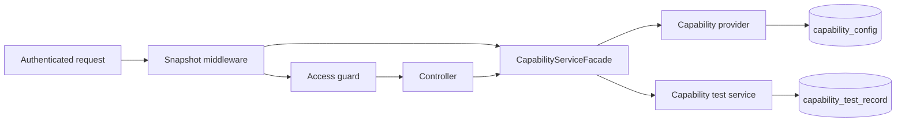

# Capability Lifecycle

Semaphore resolves enhanced capabilities in the backend and carries one immutable decision snapshot through each operation. The UI presents that decision; it is not an enforcement boundary.

The initial `lifecycle_test` capability is a clean-room contract fixture. It proves activation, downgrade, persistence, and worker enforcement without introducing a commercial entitlement or depending on a private module implementation.

## Request Flow



`CapabilityRequest` contains only the authenticated user ID, administrator status, and resolution time. The provider returns a `CapabilitySnapshot` whose decisions, access grants, and limits are copied on input and output. JSON serialization exposes the resolution time and sanitized decisions, but never the user ID or administrator flag.

Controllers depend only on `CapabilityServiceFacade`. The facade maps persistence records to transport DTOs; SQL entities do not cross the controller boundary. Services enforce access again so a background path cannot bypass the HTTP middleware.

A worker resolves one snapshot when it actually begins an action. Work already executing finishes against that snapshot, which prevents partial state caused by changing policy midway through one operation. Queued work that has not started resolves later and is rejected if the capability has since been disabled, expired, or made read-only.

## Effective States

| State | Stable reason | Read | Write | Execute | Denied HTTP status |
|---|---|:---:|:---:|:---:|---:|
| `active` | `active` | yes | yes | yes | `403` if a requested grant is absent |
| `unavailable` | `provider_unavailable` | no | no | no | `404` |
| `disabled` | `disabled_by_admin` | no | no | no | `403` |
| `expired` | `entitlement_expired` | yes | no | no | `403` |
| `read_only` | `read_only` | yes | no | no | `403` |
| `insufficient_permission` | `insufficient_permission` | no | no | no | `403` |

The provider applies lifecycle reasons before user permission. An explicit administrator disable takes precedence over an expired timestamp, then expiry takes precedence over permission. This keeps the effective reason deterministic.

Community builds always resolve `lifecycle_test` as `unavailable`, and Community service entry points reject operations even if a caller supplies a forged active snapshot.

## API

All routes require an existing opaque authenticated session or API token. Capability metadata is not stored in authentication claims.

| Method and path | Required access | Purpose |
|---|---|---|
| `GET /api/info` | authenticated | Includes the sanitized effective capability snapshot |
| `PUT /api/capabilities/lifecycle-test` | administrator | Configures `active`, `disabled`, or `read_only`, with an optional `expires_at` |
| `GET /api/capabilities/lifecycle-test/records` | read | Lists retained test records |
| `POST /api/capabilities/lifecycle-test/records` | write | Creates a record through the request path |
| `POST /api/capabilities/lifecycle-test/background-actions` | execute | Exercises the separately guarded background service entry point |

A denied request returns a stable body without protected data:

```json
{
  "error": "CAPABILITY_DENIED",
  "capability": "lifecycle_test",
  "state": "disabled",
  "reason": "disabled_by_admin",
  "required_access": "write"
}
```

Provider failures return `503` with `CAPABILITY_PROVIDER_ERROR`. Invalid configured states and record values return `400`. Unexpected operation failures return a generic `500` response while details remain in server logs.

Every allow, deny, and operation failure crosses the shared [Enhanced Security and Observability Baseline](security-observability.md). Audit events contain only typed context and server-owned correlation IDs; request values and raw provider errors are excluded from audit, logs, metrics, and HTTP errors.

## Persistence and Downgrade

Migration `2.20.2` creates two dedicated tables:

- `capability_config` stores non-secret provider state and optional expiry by typed capability ID.
- `capability_test_record` stores the lifecycle-test data independently of provider configuration.

Disabling or expiring a capability updates only effective access. It does not delete or rewrite feature data. Re-enabling the capability makes the retained records readable again. A migration rollback is different from a runtime downgrade and drops both tables; it is therefore not a feature-disable mechanism.

The record limits (`lifecycle_test_records` and `lifecycle_test_record_bytes`) demonstrate typed limits only. Commercial quota design and license issuance remain outside this slice.

## Verification

The implementation is covered by:

- immutable snapshot and sanitized JSON unit tests;
- Community rejection and clean-room enhanced lifecycle tests;
- SQL integration tests for disable/re-enable retention and migration rollback;
- concurrent provider-resolution tests;
- API middleware tests for every state and stable denial responses;
- frontend state-presentation unit tests; and
- a Chromium test of the production System Information dialog showing the backend state and reason.

The migration matrix verifies fresh install, upgrade from `2.20.1`, rollback, restart, and Community compatibility on SQLite, MySQL, MariaDB, and PostgreSQL. See the [Migration Policy](migration-policy.md) for the executable fixture and release requirements.
