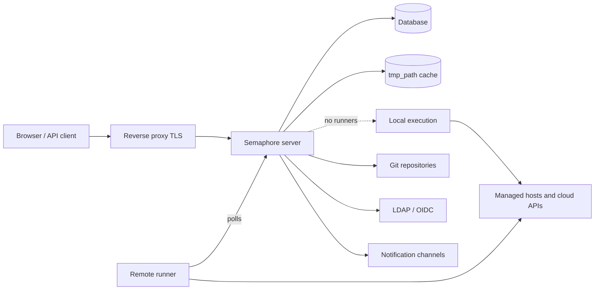

# Architecture

A Semaphore deployment has three required parts: one **server process**, one
**database**, and a **place where tasks execute**. Everything else — runners, Redis,
a reverse proxy, an identity provider — is optional and added when a specific need
appears.

## The parts

### Server

A single Go binary. It embeds the compiled web interface, so one process serves the
UI, the REST API, and a WebSocket endpoint at `/api/ws` that streams task output to
open browsers. It listens on port `3000` by default.

Inside that process run several things at once:

| Part | Responsibility |
|---|---|
| HTTP API and UI | Everything the browser and API clients call. |
| Task pool | The queue of tasks, their concurrency limits, and their state. |
| Scheduler | Starts templates on their [cron schedules](../user-guide/schedules.md). |
| Local executor | Runs tasks on the server itself when no remote runner handles them. |
| Notifier | Sends [alerts](../admin-guide/notifications.md) when tasks finish. |

### Database

SQLite, MySQL, or PostgreSQL, chosen with the `dialect` option. It holds projects,
templates, inventories, schedules, users, roles, task history, and the encrypted
contents of the Key Store. It is the only thing that must be backed up: everything
else can be rebuilt.

SQLite is the default and is suited to a single server. Use PostgreSQL or MySQL when
several people rely on the service, and always when you run more than one node.

### File cache

The directory in `tmp_path` (`/tmp/semaphore` by default) holds cloned repositories
and the working directory of each run. It is a cache, not storage: deleting it costs
one extra clone per project. **Clear cache** in the project settings does exactly that.

Whichever machine executes a task keeps this cache — the server when tasks run
locally, each runner when they do not.

## Where tasks execute

By default the server executes tasks itself, in its own file system and with its own
network access. That is the simplest setup and the right one for a small team managing
hosts the server can already reach.

Adding [runners](../admin-guide/runners.md) separates the two. A runner is the same binary
started with `semaphore runner start`. It holds no database connection and opens no
inbound port: it polls the server over HTTPS with a bearer token, receives a job,
clones the repository, runs the tool, and streams the output back. Runners let you

- place execution inside a network the server cannot reach,
- keep credentials for production on a machine that does not serve a web interface,
- spread load across several machines, and
- route a task to a specific runner with [tags](../admin-guide/runners.md#runner-tags-pro).

Each runner picks how it launches a job with its `executor.type`:

| Executor | The job runs |
|---|---|
| `local` | As a process on the runner's host, in `tmp_path`. |
| `docker` | In a container the runner starts for that job, then removes. |
| `k8s` | In a Pod the runner creates in your cluster, then removes. |

### Ports and directions

Every connection is outbound from the component that starts it, which is what makes
runners usable across network boundaries.

| From | To | Purpose |
|---|---|---|
| Browser, API client | Server `:3000` | UI, REST API, WebSocket. |
| Server | Database | All persistent state. |
| Server, runner | Git remotes | Cloning repositories. |
| Server, runner | Managed hosts, cloud APIs | The actual automation. |
| Runner | Server `:3000` | Polling for jobs, streaming output. |
| Server | LDAP, OIDC, SMTP, chat webhooks | Sign-in and notifications. |

## Scaling out

Two axes scale independently.

**More execution** means more runners. The server stays a single process, and
tasks are distributed across the runners that are connected.

**More availability** means more servers. Several nodes run against one PostgreSQL
or MySQL database with Redis for distributed locks, shared queue state, and pub/sub,
behind a load balancer that supports WebSocket. This is
[high availability](../admin-guide/ha.md).  SQLite cannot be used
for it.

## What's next

- [Core concepts](concepts.md) — the vocabulary the interface uses.
- [Security model](security-model.md) — trust boundaries and what is encrypted.
- [Installation](../admin-guide/installation.md) — pick a method and start a server.
