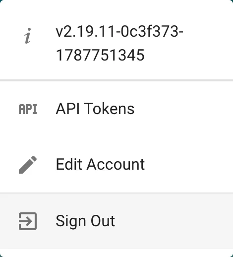
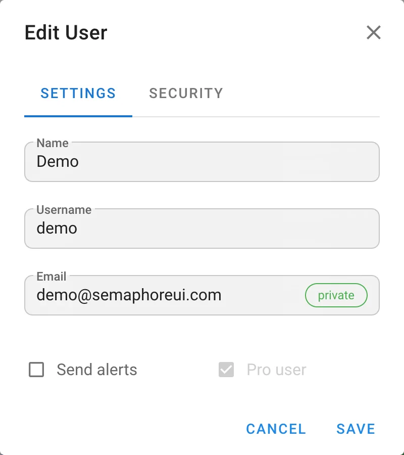
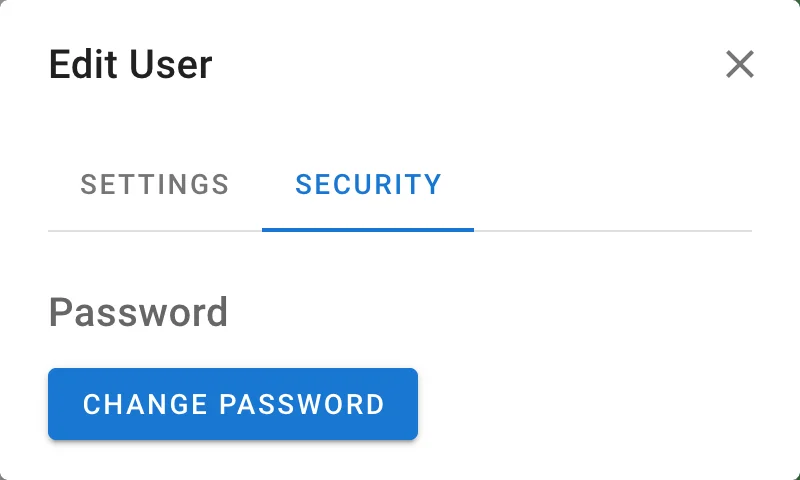

# Your account

Your personal settings live in the account menu at the bottom of the sidebar. Click your name to open it.

| Item | Description |
|---|---|ß
| Version | The Semaphore UI version running on the server. |
| **API Tokens** | Personal tokens for the [REST API](../reference/api.md). |
| **Edit Account** | Your name, username, e-mail, alert preference, and password. |
| **Sign Out** | Ends the session. |

Next to the menu you find the **dark mode** switch and the **language** switcher. Both settings are stored in your browser.

## Edit account

The **Settings** tab contains:

| Field | Description |
|---|---|
| **Name** | Display name shown in task history and activity. |
| **Username** | Login name. |
| **Email** | Address used for e-mail alerts and password recovery. |
| **Send alerts** | Receive e-mail alerts about tasks. Alerts are sent only when the [e-mail channel](../admin-guide/notifications/email.md) is configured and the project allows alerts. |

Badges next to the checkboxes show your global flags: **Admin** for administrators, **External** for accounts managed by LDAP or OpenID Connect. External users cannot change their username or password here.

The **Security** tab lets you change your password. If the administrator enabled time-based one-time passwords, the second factor is configured on the same tab.

## API tokens

Choose **API Tokens** in the account menu. The page lists your tokens with their creation date, expiration date, and status. The **API Reference** link opens the Swagger UI built into your instance.

Click **New Token**, give the token a name, and choose when it expires. The token value is shown once after creation, copy it right away.

Use the token in the `Authorization: Bearer` header, see [API](../reference/api.md). To revoke a token, delete it from the list.
