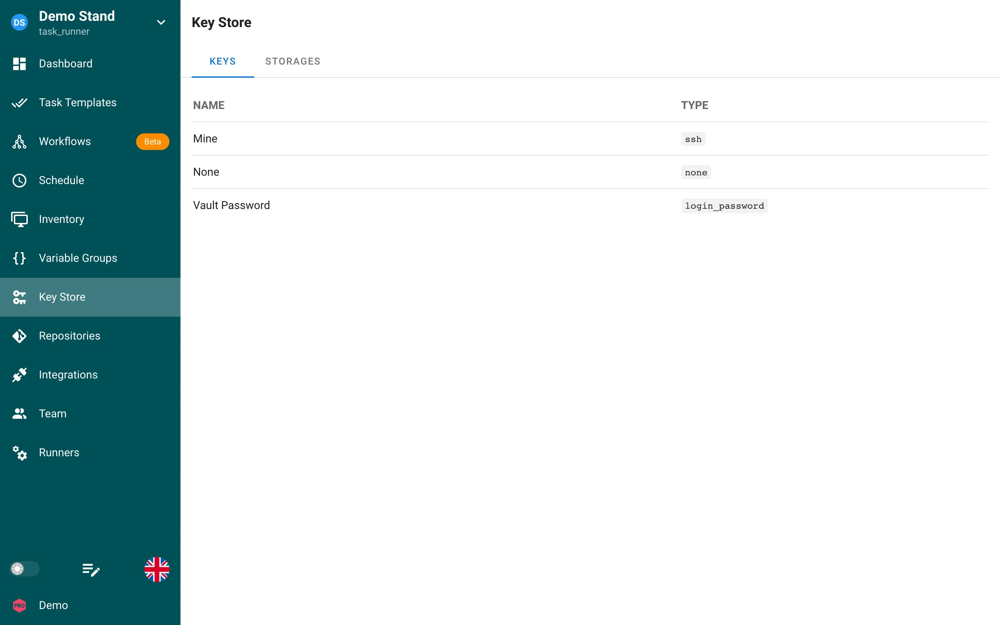
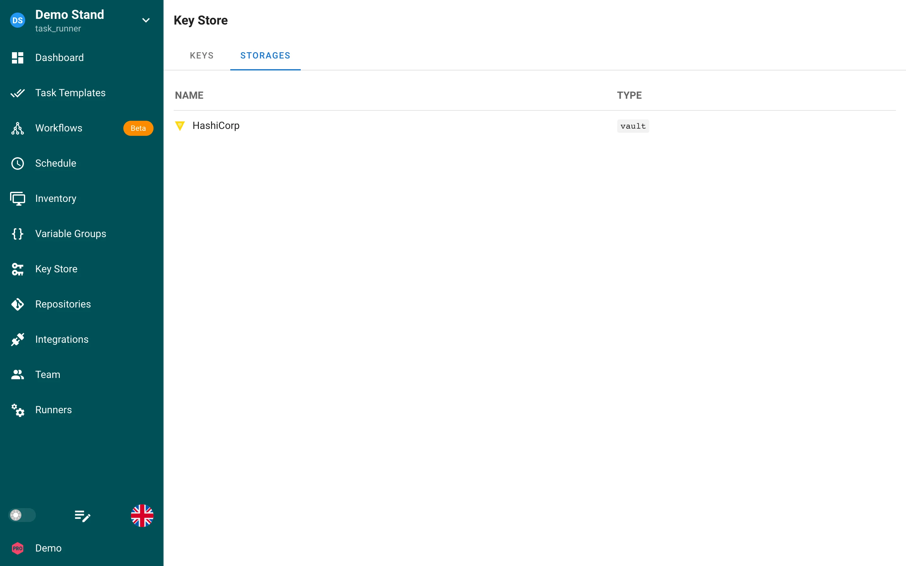

# Key Store

The Key Store in Semaphore is used to store credentials for accessing remote Repositories, accessing remote hosts, sudo credentials, and Ansible vault passwords.

The **Keys** tab lists the credentials of the project with their type. The **Storages** tab lists external secret storages configured for the project; see [Secret Storages](#secret-storages).

## Types

### 1. SSH

SSH Keys are used to access remote servers as well as remote Repositories.

For a locally stored SSH credential, Semaphore can generate the key pair on the
server. Select **Generate on server** while creating an SSH key, keep the default
**Ed25519** algorithm unless a target explicitly requires **RSA 3072**, and copy
the displayed OpenSSH public key to the target host or Git provider. Semaphore
stores the private key inside the encrypted Access Key record and never returns
it through the API or UI.

Server-side generation requires Access Key encryption to be configured. It is
not available for environment, file, external-storage, or synchronized keys.
Imported private keys continue to use the existing create and edit flow.

An authorized project member can rotate a local SSH key from the Key Store. The
confirmation shows which project resources reference the key. Rotation replaces
the private key immediately, clears affected Repository caches, and returns the
new public key and SHA-256 fingerprint. Install the new public key on every
referenced target before starting another task.

If you need assistance quickly generating a key and placing it on your host, [here is a quick guide.](https://www.digitalocean.com/community/tutorials/how-to-set-up-ssh-keys-on-ubuntu-20-04)

For Git Repositories that use SSH authentication, the Git Repository you are trying to clone from needs to have your public key associated to the private key.

Below are links to the docs for some common Git Repositories:
* [GitHub](https://docs.github.com/en/authentication/connecting-to-github-with-ssh/adding-a-new-ssh-key-to-your-github-account)
* [GitLab](https://docs.gitlab.com/ee/user/ssh.html)
* [Bitbucket](https://support.atlassian.com/bitbucket-cloud/docs/set-up-an-ssh-key/)

#### SSH keys available to a task

Semaphore EX offers the task template's Repository SSH key through a task-scoped SSH agent.
The task receives its socket as `SSH_AUTH_SOCK`, including during requirements installation.
This applies to Ansible, Terraform, OpenTofu, Terragrunt and script templates, on the server and on remote runners.

Child processes can use this key for private Ansible Galaxy collections, Git-based Terraform modules, submodules and nested Git commands.
Configure access to each dependency repository for the Repository's public key; a successful checkout of the main repository does not grant access to other repositories automatically.
There is no need to copy the private key onto the runner host or configure a host-wide Git identity for this purpose.

If the Inventory also has an SSH key, the task agent contains both identities.
The agent offers the Inventory identity first for Ansible managed-host connections; explicit Ansible connection settings keep their normal precedence.
Nested Git offers the Repository identity followed by the Inventory identity and retains the configured SSH host verification policy.
An Inventory Repository's separate SSH key is not added automatically to the task agent.
Repository keys of type **None** or **Login With Password** do not contribute an SSH identity; an Inventory SSH key remains available independently.
When neither resource nor the additional bindings below supply an SSH key, Semaphore creates no task agent and does not set `SSH_AUTH_SOCK`.

The task agent is closed and its socket removed when the task finishes, fails or is cancelled.
Private SSH keys are not exported in environment variables or written into the task's repository workspace.

#### Additional keys for dependencies

Use **Additional SSH keys** to select existing SSH credentials and the exact hosts
where each key should be used. A binding may contain several hostnames, such as
`github.com` and `gitlab.com`. Use separate bindings for keys belonging to other
hosts. URLs, repository paths and wildcard patterns are not hostnames.

Host lists are optional when the task has fewer than five distinct SSH keys.
Those keys can be offered through the common agent. At five or more keys, host
mapping is required so each connection selects the relevant identity.
Repository and Inventory keys count toward this total; repeated copies of the
same public-key identity count once. Explicit host lists apply at every size.
The Repository URL provides its own hostname; an Inventory key needs an explicit
host list when the threshold is reached because its destinations may be dynamic.
The SSH server's authentication-attempt limit remains independently configurable.

This feature configures normal SSH clients. Explicit Git/Ansible SSH overrides
take precedence, and task scripts can deliberately bypass the generated selection.

Project settings provide two lists:

- **Project defaults** are inherited by templates unless they define their own
  selection.
- **Always included** keys are added to every task in the project, including
  tasks with a custom selection.

Templates inherit project defaults, and the new-task dialog inherits the
template selection. Clear the inheritance checkbox to customize the selection.
Changing a run's selection requires permission to manage project resources.
Users with only run permission inherit the configured keys. A cross-project
run uses the template owner's selection and cannot override its SSH keys.
Removing every entry while inheritance is off means no optional additional
keys; it does not remove the project's always-included keys or the existing
Repository and Inventory keys.

The API uses `default_ssh_keys` and `always_ssh_keys` on projects and `ssh_keys`
on templates and tasks. Each entry contains `access_key_id` and a `hosts` list.
Create the project and its SSH credentials before assigning project bindings;
project creation accepts only `null` or empty lists because no keys belong to it yet.
A `null` override inherits its parent; `[]` is an explicit empty override.
Two different additional keys cannot claim the same hostname in the effective
selection. Per-repository selection between keys on the same Git host is not
supported by this feature.

Execution snapshots retain key references and host lists, not private material.
Keys are resolved again for execution so rotation and removal remain effective.
Remove a key from project policies and templates before deleting it from the
Key Store. Historical task references remain visible without blocking deletion.
API updates that omit the new SSH fields preserve their current values; use
`null` or `[]` explicitly to change inheritance or clear a selection.
Container execution uses the existing protected, read-only credential bundle
outside `/workspace` to start a separate agent inside the container.

### 2. Login With Password

Login With Password is a username and password/access token combination that can be used to do the following:
* Authenticate to remote hosts (although this is less secure than using SSH keys)
* Sudo credentials on remote hosts
* Authenticate to remote Git Repositories over HTTPS (although SSH is more secure)
* Unlock Ansible vaults

> **Tip**
>
> This type of secret can be used as Personal Access Token (PAT) or secret string. Simply leave the Login field empty.

### 3. None

This is used as a filler for Repos that do not require authentication, like an Open-Source Repository on GitLab.

## Secret Storages

Semaphore UI supports different storages for secrets. You can choose the storage per-secret when creating or editing a secret.

External storages are created on the **Storages** tab of the Key Store. Each storage has a name and a type; keys then reference the storage and the path of the secret inside it.

### Database

Secrets are stored in the database in encrypted form by default. The encryption key is configured via the configuration option
`access_key_encryption` or `SEMAPHORE_ACCESS_KEY_ENCRYPTION` (must be generated using `head -c32 /dev/urandom | base64`).

### Environment variable or file

A key can read its value from an environment variable of the Semaphore server or from a file on the server
(for example an SSH key mounted into the container). The **Env** and **File** tabs of the key form select this mode.

Files must be inside the configured secrets directory (`dirs.secrets` / `SEMAPHORE_SECRETS_PATH`, default `/tmp/semaphore`),
and SSH and Login With Password keys must be wrapped in a small JSON document.

[Read more...](key-store/env-and-file-sources.md)

### HashiCorp Vault

Secrets can be stored in an external HashiCorp Vault instance instead of the database.

[Read more...](key-store/hashicorp-vault.md)

### OpenBao

Secrets can be stored in an external [OpenBao](https://openbao.org) instance (an open-source, API-compatible fork of HashiCorp Vault).

[Read more...](key-store/openbao.md)

### AWS Secrets Manager

AWS Secrets Manager is not implemented in Semaphore EX. Use HashiCorp Vault or
OpenBao for an external secret store.

### Devolutions Server

Devolutions Server is not implemented in Semaphore EX. Use HashiCorp Vault or
OpenBao for an external secret store.

## Syncing secrets from remote storages

Semaphore can automatically import secrets from HashiCorp Vault or OpenBao and keep
them in sync. Sync paths let you choose which secrets to import and how to name them.

[Read more...](key-store/secret-sync.md)

## Granted global credentials

Enhanced Edition can grant a project permission to select a credential that is administered globally.
Open the **Granted** tab in the project's Key Store to see the value-free references available to your project role.

The list shows only the display name, type, current version, effective operations, and optional expiry.
It never shows the credential value, owner, fingerprint, or external provider path.

Select a row when a workflow or resource asks for a granted credential reference.
Selection identifies the credential by its stable ID; it does not retrieve or copy the value into the project.

If the tab reports that your role cannot list granted metadata, ask a project administrator for a role containing **List granted credential metadata**.
The separate **Consume granted credentials** permission controls runtime use and does not imply list access.

A revoked, expired, or disabled grant disappears from the list immediately.
Rotation keeps the same credential ID, so projects do not need a copied replacement value.
