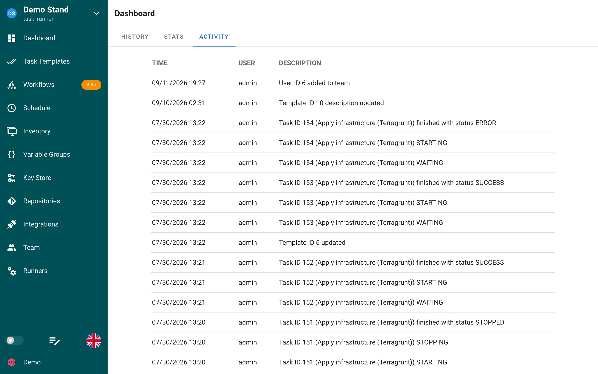

# Activity

The Activity page provides a comprehensive audit trail of all actions and events that occur within your project. This feature tracks user activities, system events giving you complete visibility into what's happening in your project.

Each row shows the time, the user who performed the action, and a description, for example a task status change, a template update, or a team change. Events are ordered newest first.

## Overview

The Activity page displays a chronological feed of all project activities, including:

- User actions (creating, editing, deleting resources)
- System events and notifications
- Access and permission changes
