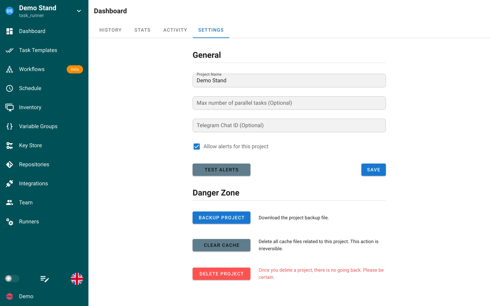

# Settings

The **Settings** tab of the project dashboard is available to project **Owners**. It holds the general project options and the destructive actions.

## General

| Field | Description |
|---|---|
| **Project Name** | Display name shown in the project switcher and in alerts. |
| **Max number of parallel tasks** | Optional. Maximum number of tasks of this project that may run at the same time. Leave it empty for no limit. Tasks above the limit stay in the queue with the status `waiting` until a slot is free. |
| **Telegram Chat ID** | Optional. Sends alerts for this project to a different Telegram chat than the one configured globally. See [Telegram notifications](../../admin-guide/notifications/telegram.md#per-project-chat-ids). |
| **Allow alerts for this project** | Master switch for notifications. When it is off, no channel sends alerts about tasks of this project, even if the channel is configured on the server. |

**Test alerts** sends a test message through every configured [notification channel](../../admin-guide/notifications.md), so you can verify the server configuration without running a task. **Save** applies the changes.

## Danger Zone

| Action | Effect |
|---|---|
| **Backup project** | Downloads a JSON file with the project definition: templates, inventories, variable groups, keys (without secret values), repositories, schedules, views, and integrations. Restore it through **New Project → Restore project** or with [`semaphore projects import`](../../reference/cli/projects.md). |
| **Clear cache** | Deletes all cached files of the project on the server, for example cloned repositories. The next task clones the repositories again. The action is irreversible. |
| **Delete project** | Deletes the project with all its resources and task history. There is no undo. |

## Related settings

- Members and roles: [Teams](../team.md)
- Runners attached to the project and runner tags: [Project runners](runners.md)
- Notification channels are configured on the server: [Notifications](../../admin-guide/notifications.md)
