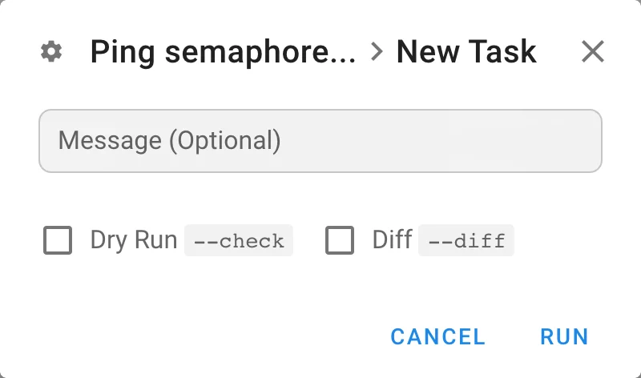
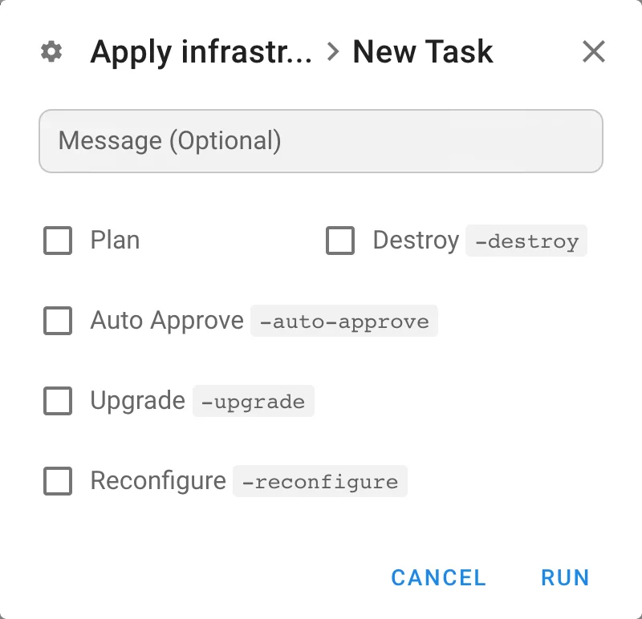
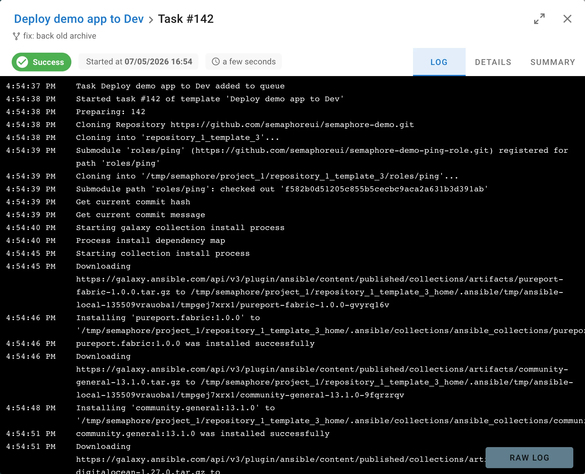
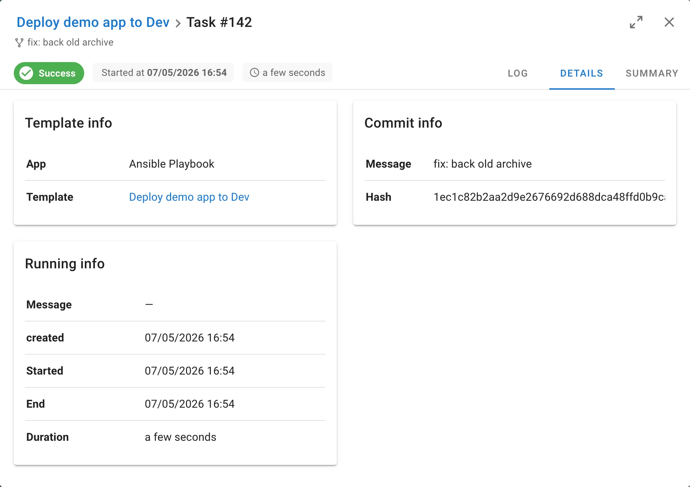
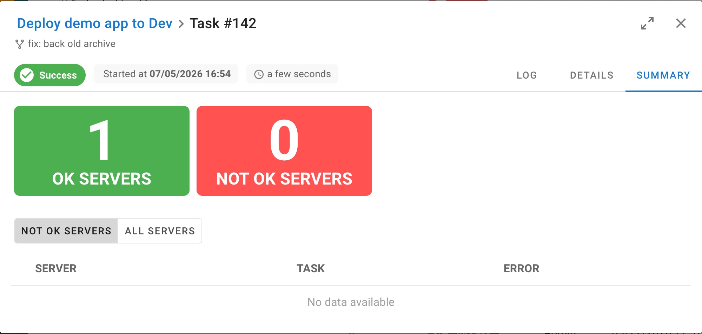
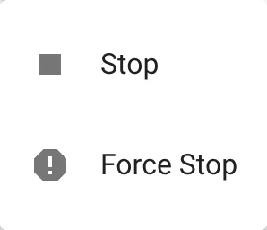
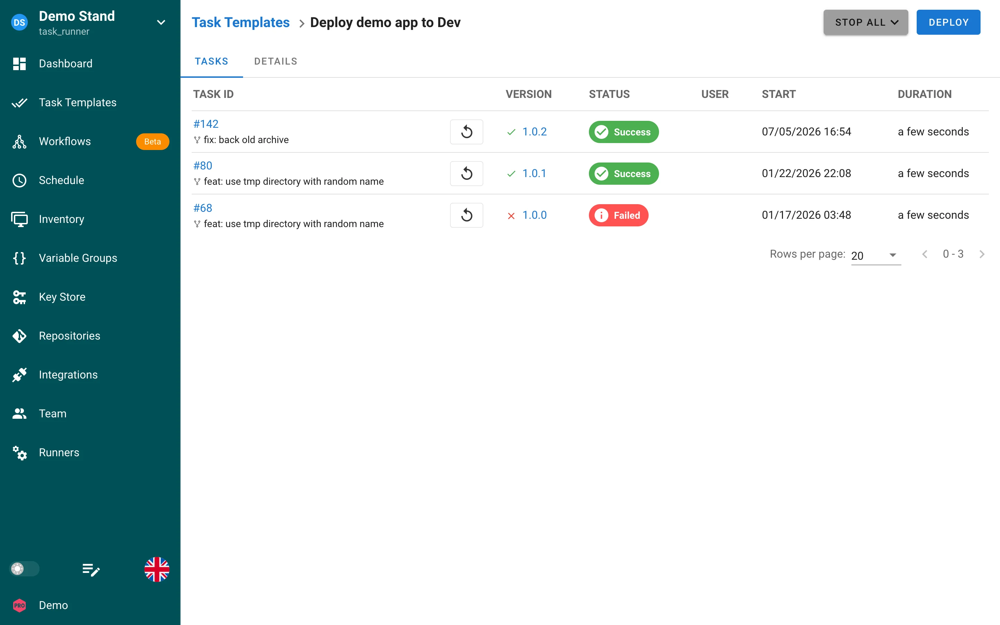

# Tasks

A task is a single execution of a [task template](task-templates/README.md): one run of an Ansible playbook, a Terraform/OpenTofu/Terragrunt configuration, or a Bash, PowerShell, or Python script. Every task keeps its own log, status, and details, so you can always see what ran, when, by whom, and with which revision of the repository.

## Starting a task

You need the **Task Runner** role or higher in the project (see [Teams](team.md)). Start a task in one of two places:

- In **Task Templates**, click the **play** button in the row of the template.
- On the template page, click the button in the top right corner. Its label depends on the template type: **Run**, **Build**, or **Deploy**.

Both open the **New Task** dialog. Its content depends on the application and on the options enabled in the template.

| Field | Shown for | Description |
|---|---|---|
| **Message** | all templates | Optional note stored with the task and shown in history and alerts. |
| **Build Version** | deploy templates | Which build to deploy. The latest successful build is selected by default. See [Build and deploy templates](task-templates/build-deploy.md). |
| Survey variables | templates with [survey variables](task-templates/survey-vars.md) | One input per variable; required variables must be filled. |
| **Dry Run** `--check`, **Diff** `--diff` | Ansible | Run the playbook in check mode or show file changes. Other Ansible prompts (Limit, Tags, Skip tags, Debug) appear when enabled in the template, see [Prompts](task-templates/prompts.md). |
| **Plan**, **Destroy**, **Auto Approve**, **Upgrade**, **Reconfigure** | Terraform, OpenTofu, Terragrunt | Run `plan` only, add `-destroy`, `-auto-approve`, `-upgrade`, or `-reconfigure`. See [Terraform/OpenTofu](apps/terraform/README.md). |
| **Branch**, **Inventory**, **CLI args** | any application | Override the template values for this run. Each override must be allowed in the template settings. |

Click **Run** (or **Build** / **Deploy**) to put the task into the queue.

### Queue and parallel execution

Tasks of the same template run one after another unless **Allow parallel tasks** is enabled in the template. The project can also limit the total number of running tasks with **Max number of parallel tasks** in [project settings](projects/settings.md). A task that has to wait stays in the `waiting` status and starts automatically when a slot is free.

## SSH authentication from task commands

Tasks whose Repository uses an SSH key receive a task-scoped agent through `SSH_AUTH_SOCK`.
Requirements installers and commands started by the task can use the same identity that authenticates Semaphore's Repository checkout.
For example, this supports Ansible Galaxy collections and Terraform modules stored in private Git repositories.
The Inventory SSH key, when present, is available first in the same agent for Ansible managed-host connections, with explicit Ansible connection settings preserved.
See [SSH keys available to a task](key-store.md#ssh-keys-available-to-a-task) for key selection and cleanup behavior.

## Task window

Clicking a task anywhere in the UI opens the task window. The header shows the template, the task number, the commit message of the repository revision, the status badge, who started the task and when, and the duration. The arrows icon expands the window to full screen.

| Tab | Content |
|---|---|
| **Log** | Live output of the task with timestamps. The log is streamed while the task runs. **Raw log** opens the unprocessed output in a new browser tab. |
| **Details** | Template info (application, template), commit info (message and hash), and running info: message, created, started, and end time, duration, and, when set, the runner, branch, limit, and variables used for the run. |
| **Summary** | For Ansible tasks: how many hosts finished OK and how many failed, with a table of failed tasks per server. |

### Ansible task summary

The enhanced edition shows a persisted result summary for Ansible tasks. It includes healthy and failed host totals, per-host recap counters, aggregated stage results, and redacted failure details. Large inventories are displayed in bounded pages.

The summary can be in one of these states:

- **Collecting** means the task is still producing results.
- **Complete** means every expected host summary was stored.
- **Partial** means some results are available but collection was interrupted. The warning explains what is missing; it does not change the task result.
- **Empty** means the finished task produced no supported host results.
- **Unsupported** means the runner used a result format newer than the server understands. The raw task log remains available.

Refreshing the task page loads the same persisted summary rather than reparsing the raw log. Failure messages are bounded and common credential values are redacted before they are stored.

## Task statuses

| Status | Meaning |
|---|---|
| `waiting` | The task is in the queue: another task of the same template is running, the project limit is reached, or no runner is available yet. |
| `starting` | A runner picked the task and is preparing the repository and the environment. |
| `waiting_confirmation` | The tool asked a question and waits for a user, for example `terraform apply` without **Auto Approve** or a script that reads input. Use **Confirm** or **Reject** in the task window. |
| `confirmed` | A user confirmed the question; the task continues. |
| `rejected` | A user rejected the question; the task ends. |
| `running` | The playbook or script is executing. |
| `stopping` | A stop was requested and the process is being terminated. |
| `stopped` | The task was stopped by a user. |
| `success` | Finished with exit code 0. |
| `error` | Finished with a non-zero exit code or failed to start. Shown as **Failed** in the UI. |

## Stopping tasks

Open the task window of a running task and click **Stop**. Semaphore sends a termination signal and the task goes to the `stopping` status while the process exits. If the process does not react, the button changes to **Force Stop**; click it to kill the process immediately.

To stop every running and queued task of one template, open the template page and use **Stop all**. The dropdown offers both **Stop** and **Force stop**.

## Running a task again

On the **Tasks** tab of a template every row has a **rerun** button. It opens the New Task dialog with the message and parameters of that task filled in.

## Where tasks are listed

- **Dashboard → History**: all tasks of the project, see [History](projects/history.md).
- **Template page → Tasks**: tasks of one template.
- **Task Templates**: expand a row with the arrow on the left to see the latest tasks of the template without leaving the list.

## Log retention

Tasks and logs are kept forever by default. Use `max_tasks_per_template` to keep only the latest tasks of each template, see [History](projects/history.md#task-retention).
