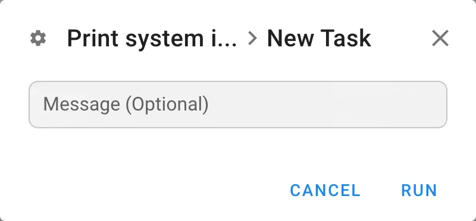

# Shell-/Bash-Skripte

Semaphore kann Shell-Skripte mit `/bin/bash` ausführen. Erstellen Sie dazu ein **Bash Script**-Task-Template.

<a id="creating-a-bash-template"></a>

## Ein Bash-Template erstellen

1. Öffnen Sie den Bereich **Task-Templates** und klicken Sie auf die Schaltfläche **Neues Template**.
2. Wählen Sie **Bash** als App-Typ.
3. Konfigurieren Sie das Template:

| Feld | Beschreibung |
|---|---|
| **Name** | Ein aussagekräftiger Name für das Template |
| **Repository** | Repository, das Ihr Shell-Skript enthält |
| **Playbook / Skript** | Relativer Pfad zum Skript, z. B. `scripts/deploy.sh` |
| **Variablengruppen** | Variablengruppen, deren Werte als Umgebungsvariablen eingefügt werden |

4. Klicken Sie auf **Erstellen**.
5. Klicken Sie auf **Ausführen**, um das Template auszuführen. Der Dialog für einen neuen Task enthält bei einem Skript-Template nur die optionale Nachricht sowie Survey-Variablen und Prompts, sofern das Template sie definiert.



<a id="passing-variables-to-scripts"></a>

## Variablen an Skripte übergeben

Variablen aus den ausgewählten **Variablengruppen** werden als Umgebungsvariablen eingefügt. Greifen Sie im Skript mit `$VARIABLE_NAME` darauf zu:

```bash
#!/bin/bash
echo "Deploying to $TARGET_HOST"
```

<a id="notes"></a>

## Hinweise

- Machen Sie Ihr Skript ausführbar (`chmod +x`) oder stellen Sie sicher, dass es mit einem gültigen Shebang (`#!/bin/bash`) beginnt.
- Skripte laufen nicht interaktiv. Vermeiden Sie Abfragen, die auf Benutzereingaben warten.
- Exit-Code `0` bedeutet Erfolg; jeder Exit-Code ungleich null markiert den Task als fehlgeschlagen.
- Wenn ein sehr kurzes Skript keine Log-Ausgabe erzeugt, siehe [Ausgabe eines Bash-Skripts fehlt oder ist unvollständig](../../../../docs/faq/troubleshooting.md#bash-script-output-is-missing-or-incomplete) in der Anleitung zur Fehlerbehebung.
- Um Befehle auf entfernten Hosts auszuführen, verwenden Sie stattdessen [Ansible](ansible.md).
