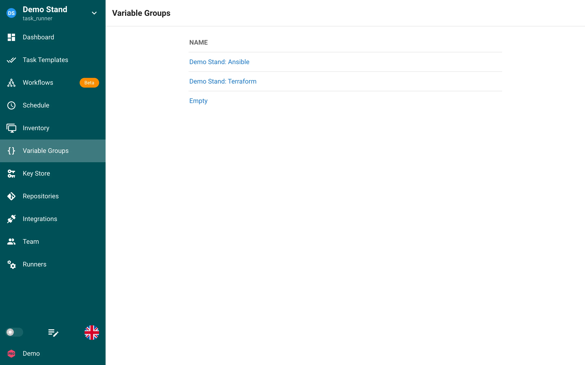

# Grupos de variables



La sección Grupos de variables de Semaphore es el lugar donde se guardan variables adicionales para un inventario, y deben almacenarse en formato JSON.

Todas las plantillas de tareas requieren que se defina un grupo de variables, aunque esté vacío.

<a id="create-a-variable-group"></a>

## Crear un grupo de variables

1. Haga clic en la pestaña Grupo de variables.
2. Haga clic en el botón Nuevo grupo de variables.
3. Asigne un nombre al grupo de variables y escriba o pegue variables JSON válidas. Si solo necesita un grupo de variables vacío, escriba ```{}```.

<a id="updating-a-variable-group"></a>

## Actualizar un grupo de variables

1. Haga clic en la pestaña Grupos de variables.
2. Haga clic en el icono del lápiz.
3. Realice sus cambios y haga clic en guardar.

<a id="deleting-the-variable-group"></a>

## Eliminar el grupo de variables

Antes de eliminar un grupo de variables, debe eliminar todos los recursos vinculados a él.
Si no está seguro de qué recursos se usan en un grupo de variables, siga los pasos 1 y 2 a continuación. Se le mostrará qué recursos se están usando, con enlaces a dichos recursos.

1. Haga clic en el Grupo de variables.
2. Haga clic en el icono de la papelera junto al grupo de variables.
3. Haga clic en Sí si está seguro de que desea eliminar el grupo de variables.

<a id="using-variable-groups---terraformopentofu"></a>

## Uso de los grupos de variables: Terraform/OpenTofu

Cuando quiera utilizar una variable o un secreto guardado en un grupo de variables en su plantilla de Terraform, debe añadir el prefijo `TF_VAR_` al nombre para que el script de Terraform pueda usarlo.

**Ejemplo**
Pasar la clave de la API de Hetzner Cloud a un playbook de OpenTofu/Terraform.

1. Haga clic en Grupo de variables
2. Haga clic en `New Group`
3. Haga clic en la pestaña `Secrets`
4. Añada `TF_VAR_hcloud_token` y escriba su `secret` en el campo oculto
5. Haga clic en Guardar

Llamaremos a nuestro secreto `TF_VAR_hcloud_token` como `var.hcloud_token` en
hetzner.tf
```
terraform {
  required_providers {
    hcloud = {
      source  = "hetznercloud/hcloud"
      version = "~> 1.45"
    }
  }
}

# Declare the variable
variable "hcloud_token" {
  type        = string
  description = "Hetzner Cloud API token"
  sensitive   = true  # This prevents the token from being displayed in logs
}

provider "hcloud" {
  token = var.hcloud_token
}

# Create a new server running debian
resource "hcloud_server" "webserver" {
  name        = "webserver"
  image       = "ubuntu-24.04"
  server_type = "cpx11"
  location    = "ash"
  ssh_keys = [ "mysshkey" ]
  public_net {
    ipv4_enabled = true
    ipv6_enabled = true
  }
}
```
