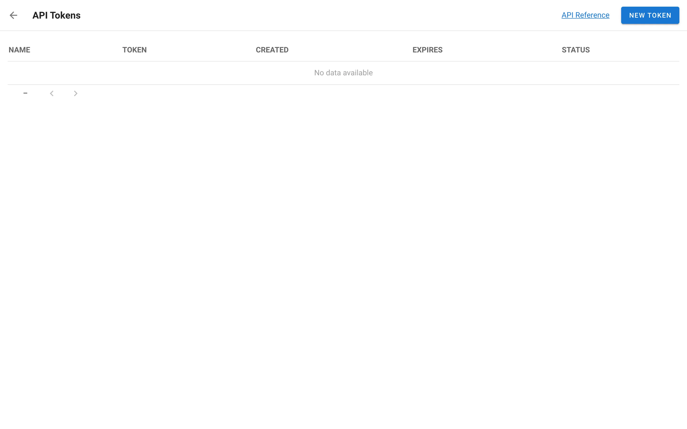
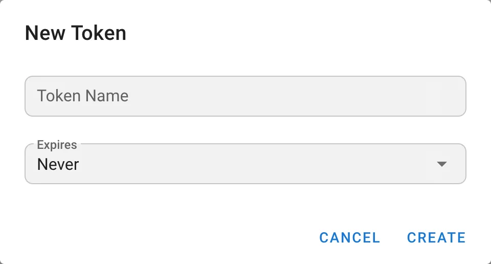

# API

<a id="api-reference"></a>

## Riferimento API

Semaphore UI fornisce due formati di documentazione API, in modo da poter scegliere quello più adatto al proprio flusso di lavoro:

* [Swagger/OpenAPI](../../../docs/reference/api.md) &mdash; ideale se si preferisce un'esperienza interattiva nel browser.
* [Collezione Postman ufficiale](https://www.postman.com/semaphoreui) &mdash; esplorare e testare tutti gli endpoint in Postman.
* **Documentazione API Swagger integrata** &mdash; documentazione API interattiva basata su Swagger UI. È accessibile dalla propria istanza.


Tutte le opzioni includono la documentazione completa degli endpoint disponibili, dei parametri e delle risposte di esempio.

<a id="getting-started-with-the-api"></a>

## Primi passi con l'API

Per iniziare a utilizzare l'API di Semaphore è necessario generare un token API.
Questo token deve essere incluso nell'intestazione della richiesta nel modo seguente:

```http
Authorization: Bearer YOUR_API_TOKEN
```

<a id="creating-an-api-token"></a>

### Creazione di un token API

Esistono due modi per creare un token API:
- Tramite l'interfaccia web
- Tramite richiesta HTTP

<a id="through-the-web-interface-since-214"></a>

#### Tramite l'interfaccia web (dalla versione 2.14)

Aprire il menu dell'account in fondo alla barra laterale e scegliere **API Tokens**. La pagina elenca i propri token; il collegamento **API Reference** presente nella pagina apre la Swagger UI integrata nella propria istanza.



Fare clic su **New Token**, inserire un nome, scegliere la scadenza del token e copiare il valore mostrato dopo la creazione. Vedere [Il proprio account](../../../docs/user-guide/account.md#api-tokens).



<a id="using-http-request"></a>

#### Tramite richiesta HTTP

È inoltre possibile autenticarsi e generare un token di sessione tramite una richiesta HTTP diretta.

Accedere a Semaphore (la password deve essere preceduta dai caratteri di escape, ad esempio `slashy\\pass` invece di `slashy\pass`):

```bash
curl -v -c /tmp/semaphore-cookie -XPOST \
-H 'Content-Type: application/json' \
-H 'Accept: application/json' \
-d '{"auth": "YOUR_LOGIN", "password": "YOUR_PASSWORD"}' \
http://localhost:3000/api/auth/login
```

Generare un nuovo token e ottenerne il valore:

```bash
curl -v -b /tmp/semaphore-cookie -XPOST \
-H 'Content-Type: application/json' \
-H 'Accept: application/json' \
http://localhost:3000/api/user/tokens
```

Il comando dovrebbe restituire un risultato simile al seguente:

```json
{
    "id": "YOUR_ACCESS_TOKEN",
    "created": "2025-05-21T02:35:12Z",
    "expired": false,
    "user_id": 3
}
```
---

<a id="using-token-to-make-api-requests"></a>

## Utilizzo del token per effettuare richieste API

Una volta ottenuto il token API, includerlo nell'intestazione **Authorization** per autenticare le proprie richieste.

<a id="launch-a-task"></a>

### Avvio di un task

Utilizzare questo token per avviare un task o per qualsiasi altra operazione:

```bash
curl -v -XPOST \
-H 'Content-Type: application/json' \
-H 'Accept: application/json' \
-H 'Authorization: Bearer YOUR_ACCESS_TOKEN' \
-d '{"template_id": 1}' \
http://localhost:3000/api/project/1/tasks
```

---

<a id="expiring-an-api-token"></a>

## Scadenza di un token API

Se il token non è più necessario, è consigliabile farlo scadere per mantenere sicuro il proprio account.

Per revocare manualmente (far scadere) un token API, inviare una richiesta DELETE all'endpoint dei token:

```bash
curl -v -XDELETE \
-H 'Content-Type: application/json' \
-H 'Accept: application/json' \
-H 'Authorization: Bearer YOUR_ACCESS_TOKEN' \
http://localhost:3000/api/user/tokens/YOUR_ACCESS_TOKEN
```
