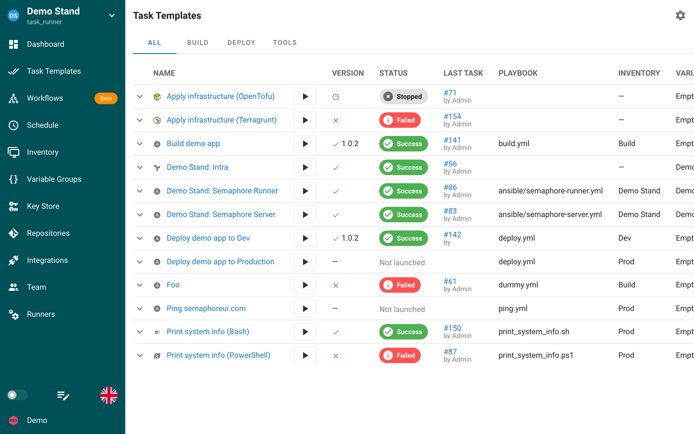

# Terragrunt

[Terragrunt](https://terragrunt.gruntwork.io/) è un wrapper per Terraform e OpenTofu che mantiene le configurazioni DRY e gestisce le dipendenze tra i moduli. Semaphore lo esegue nello stesso modo di [Terraform/OpenTofu](../../../../docs/user-guide/apps/terraform/README.md), con alcune differenze descritte qui.

## Prerequisiti

1. Installare il binario `terragrunt` e un binario `terraform` oppure `tofu` sul server Semaphore o sul [Runner](../../../../docs/admin-guide/runners.md) che esegue i Task.
2. Abilitare l'applicazione **Terragrunt Code**: per impostazione predefinita è disabilitata. Aprire **Applications** dal menu dell'account e attivare l'interruttore, vedere [Applicazioni](../../../../docs/user-guide/apps/README.md).

## Creazione di un Task Template Terragrunt

1. Andare in **Task Templates** e fare clic su **New Template**.
2. Selezionare **Terragrunt Code** come App.
3. Impostare il **Repository** e la sottodirectory che contiene il file `terragrunt.hcl`.
4. Selezionare o creare un **Workspace** nel campo Inventory. I Task Template Terragrunt utilizzano Inventory di tipo `terragrunt-workspace`, vedere [Workspace](terraform/workspaces.md).
5. Fare clic su **Create**, poi su **Run**.

## Esecuzione dei Task

La finestra di dialogo New Task offre le stesse opzioni previste per Terraform: **Plan**, **Destroy**, **Auto Approve**, **Upgrade** e **Reconfigure**.

Semaphore invoca `terragrunt run -- <terraform arguments>` e passa il binario di Terraform o OpenTofu tramite `--tf-path`, a meno che `--tf-path` non sia già impostato negli argomenti CLI del Task Template. La selezione del workspace viene eseguita con `terragrunt run -- workspace select -or-create=true <name>`.

Le variabili dei **Variable Group** selezionati vengono passate come variabili d'ambiente, quindi utilizzare il prefisso `TF_VAR_` per le variabili di input. Le variabili aggiuntive e le variabili di survey vengono passate come argomenti `-var name=value`.

## Note

- `terragrunt` esegue automaticamente `init` prima di ogni comando.
- Il backend di stato HTTP e l'elenco degli stati nella scheda **Workspaces** funzionano come per Terraform, vedere [Backend HTTP](../../../../docs/user-guide/apps/terraform/states.md).
- Per utilizzare `run-all` su più moduli, aggiungere gli argomenti nel campo **CLI args** del Task Template.
