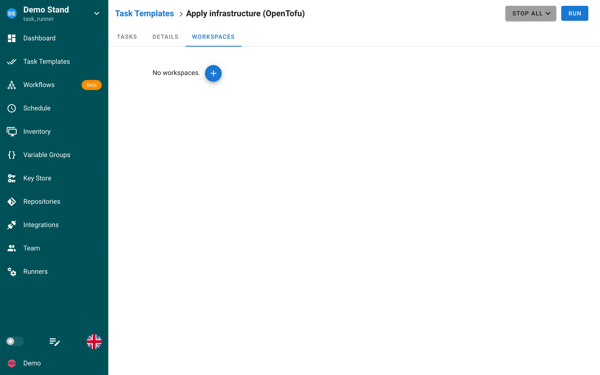

# Workspaces

O Semaphore oferece suporte integrado a workspaces do Terraform, permitindo gerenciar vários ambientes e configurações em um único projeto. Esse recurso ajuda você a manter arquivos de estado separados para diferentes ambientes, como desenvolvimento, homologação e produção.

## Recursos

- **Gerenciamento de Workspaces**: crie, alterne e exclua workspaces diretamente na interface do Semaphore.
- **Isolamento de Estado**: cada workspace mantém seu próprio arquivo de estado, evitando conflitos entre ambientes.
- **Variáveis de Ambiente**: configure variáveis de ambiente específicas de cada workspace.
- **Seleção de Workspace**: escolha o workspace de destino ao executar comandos do Terraform.

## Usando Workspaces no Semaphore

### Criando um Workspace

Na seção **Workspaces** do modelo Terraform/OpenTofu ao qual você deseja adicionar um workspace, siga estes passos:

1. Clique no botão ➕.
2. No menu que aparece, selecione **Novo Workspace**.
3. Na caixa de diálogo, insira o nome do workspace e selecione a chave SSH a ser usada para clonar os módulos.
4. Clique no botão **Criar** para adicionar o novo workspace ao modelo.
5. Agora você pode usar esse workspace para executar tarefas.

### Alternando workspaces

Você pode definir o workspace padrão de um modelo Terraform/OpenTofu clicando no botão **TORNAR PADRÃO**.

### Variáveis específicas de workspace

Atualmente, o Semaphore não oferece suporte a variáveis específicas de workspace.
