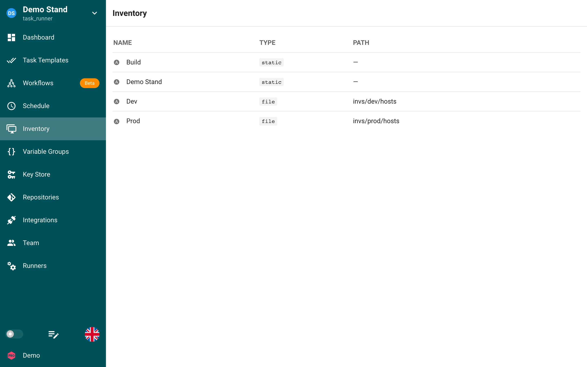

# Inventário

Um Inventário é um arquivo que contém uma lista de hosts nos quais o Ansible executará os plays.
Um Inventário também armazena variáveis que podem ser usadas pelos playbooks. Um Inventário pode ser armazenado em YAML, JSON ou TOML.
Mais informações sobre Inventários podem ser encontradas na [Documentação do Ansible.](https://docs.ansible.com/ansible/latest/inventory_guide/intro_inventory.html)

O Semaphore UI pode ler um Inventário de um arquivo no servidor ao qual o usuário do Semaphore tenha acesso de leitura, ou um Inventário estático que é editado pela interface web.
Cada Inventário também possui pelo menos uma credencial vinculada a ele.
A credencial de usuário é obrigatória e é o que o Ansible usa para fazer login nos hosts desse Inventário. As credenciais de sudo são usadas para elevar privilégios nesse host.
Para criar um Inventário, é necessário ter uma credencial de usuário que seja um nome de usuário com login ou um SSH configurado no Armazenamento de Chaves.
Informações sobre credenciais podem ser encontradas na seção [Armazenamento de Chaves](../../../docs/user-guide/key-store.md) deste site.

## Tipos de inventário

| Tipo | Descrição |
|---|---|
| `static` | Inventário no formato INI editado na interface web. |
| `static-yaml` | Inventário no formato YAML editado na interface web. Use-o para inventários de plugin, como [NetBox](inventory/netbox-dynamic-inventory.md) ou [Consul](inventory/consul-dynamic-inventory.md). |
| `file` | Caminho para um arquivo de inventário. Um caminho relativo aponta para dentro do repositório do modelo; um caminho absoluto, para um arquivo no servidor. Opcionalmente, selecione um **Repositório de inventário** separado se o arquivo estiver em outro repositório Git. |
| `terraform-workspace`, `tofu-workspace`, `terragrunt-workspace` | Não é um inventário do Ansible: é um workspace para modelos [Terraform/OpenTofu](apps/terraform/workspaces.md) e [Terragrunt](apps/terragrunt.md). |

## Criando um Inventário

1. Clique na aba Armazenamento de Chaves e confirme que você possui uma chave do tipo login_password ou ssh
2. Clique na aba Inventário e clique em Novo Inventário
3. Dê um nome ao Inventário e selecione a credencial de usuário correta no menu suspenso. Selecione a credencial de sudo correta, se necessário
4. Selecione o tipo de Inventário
  * Se você selecionar file, use o caminho absoluto do arquivo. Se esse arquivo estiver no seu repositório git, use o caminho relativo. Ex.: `inventory/linux-hosts.yaml`
  * Se você selecionar static ou static-yaml, cole ou digite seu Inventário no formulário
5. Clique em Criar.

## Atualizando um Inventário

1. Clique na aba Inventário
2. Clique no ícone de lápis ao lado do Inventário que deseja editar
3. Faça suas alterações
4. Clique em Salvar

## Excluindo um Inventário

Antes de remover um Inventário, você deve remover todos os recursos vinculados a ele.
Se você não tem certeza de quais recursos estão sendo usados em um ambiente, siga os passos 1 e 2 abaixo. Eles mostrarão quais recursos estão sendo usados, com links para esses recursos.

1. Clique na aba Inventário
2. Clique no ícone de lixeira ao lado do Inventário
3. Clique em Sim se tiver certeza de que deseja remover o Inventário
