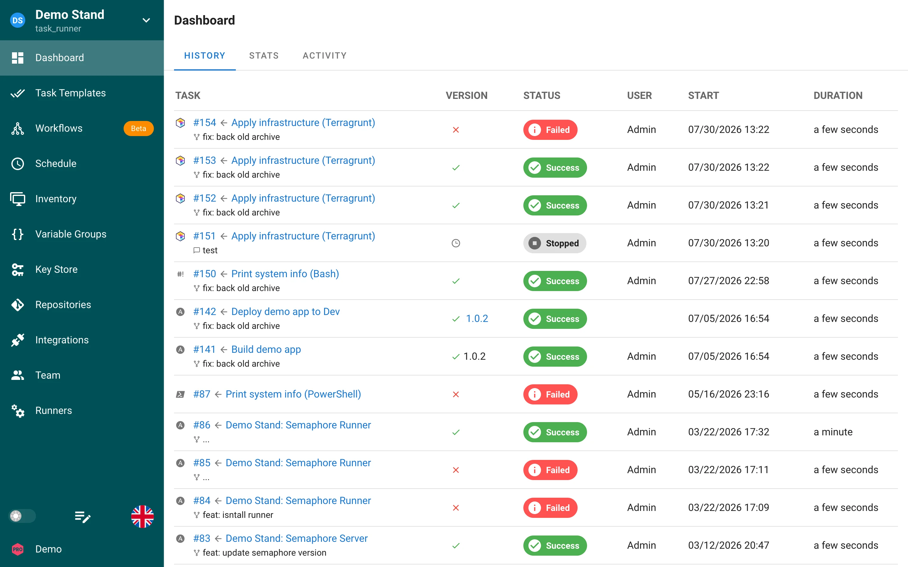

# Histórico

A aba **Histórico** do dashboard do projeto lista todas as tarefas do projeto, da mais recente para a mais antiga. É a visualização padrão ao abrir um projeto.



<a id="columns"></a>

## Colunas

| Coluna | Conteúdo |
|---|---|
| **Tarefa** | Número da tarefa, o template a partir do qual ela foi criada e a mensagem do commit da revisão do repositório que foi usada. Um ícone à esquerda mostra a aplicação (Ansible, Terraform, Bash e assim por diante). |
| **Versão** | Para [templates de build e deploy](../task-templates/build-deploy.md): a versão construída ou implantada. Para os demais templates, apenas um ícone de status. |
| **Status** | Selo do status atual; consulte [Status das tarefas](../../../../docs/user-guide/tasks.md#task-statuses). |
| **Usuário** | Quem iniciou a tarefa. Tarefas iniciadas por um agendamento ou por uma integração não têm usuário. |
| **Início** | Data e hora de início no fuso horário do seu navegador. |
| **Duração** | Por quanto tempo a tarefa foi executada. |

A lista é paginada. Clique no número da tarefa ou no nome do template para abrir a [janela da tarefa](../../../../docs/user-guide/tasks.md#task-window) com o log, os detalhes e o resumo. Clique no nome do template no cabeçalho da janela da tarefa para ir à página do template.

<a id="task-retention"></a>

## Retenção de tarefas

Por padrão, todas as tarefas e seus logs são mantidos para sempre. Para limitar o histórico por template, defina `max_tasks_per_template` no `config.json` ou a variável de ambiente `SEMAPHORE_MAX_TASKS_PER_TEMPLATE`:

```json
{
  "max_tasks_per_template": 30
}
```

Quando o limite é atingido, as tarefas mais antigas desse template são excluídas junto com seus logs. Consulte [Configuração](../../../../docs/admin-guide/configuration.md) para a lista completa de opções.

<a id="see-also"></a>

## Veja também

- [Estatísticas](stats.md): resultados agregados das tarefas por dia.
- [Atividade](activity.md): log de auditoria das alterações no projeto.
