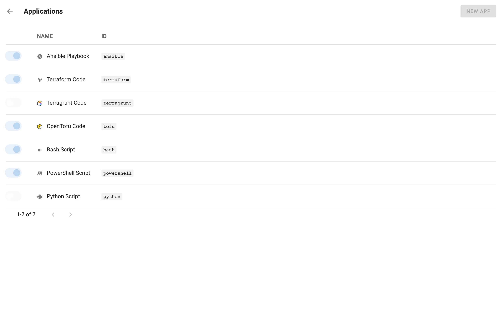

# Приложения

Приложение — это инструмент, который запускает шаблон задачи. В Semaphore встроено семь приложений; администраторы могут включать и отключать их, а также регистрировать собственные.

| Приложение | Идентификатор | Что запускает шаблон | Руководство |
|---|---|---|---|
| Ansible Playbook | `ansible` | `ansible-playbook` с выбранным инвентарём | [Ansible](ansible.md) |
| Terraform Code | `terraform` | `terraform` в выбранном подкаталоге и рабочем пространстве | [Terraform/OpenTofu](../../../../docs/user-guide/apps/terraform/README.md) |
| OpenTofu Code | `tofu` | `tofu` с теми же опциями, что и Terraform | [Terraform/OpenTofu](../../../../docs/user-guide/apps/terraform/README.md) |
| Terragrunt Code | `terragrunt` | `terragrunt` поверх Terraform или OpenTofu | [Terragrunt](terragrunt.md) |
| Bash Script | `bash` | shell-скрипт через `/bin/bash` | [Shell](bash.md) |
| PowerShell Script | `powershell` | скрипт `.ps1` через `pwsh` | [PowerShell](powershell.md) |
| Python Script | `python` | скрипт `.py` через `python3` | [Python](python.md) |

Сам инструмент должен быть установлен на машине, которая выполняет задачи: на сервере Semaphore или на [раннере](../../../../docs/admin-guide/runners.md). Официальный Docker-образ содержит Ansible, Terraform, OpenTofu, Bash и Python.

## Управление приложениями

Администраторы открывают раздел **Applications** из меню учётной записи внизу боковой панели.

Переключатель в каждой строке включает или отключает приложение. Отключённое приложение не предлагается в форме шаблона, но существующие шаблоны продолжают работать. При создании шаблона доступны только включённые приложения, поэтому отключите инструменты, которые не установлены на вашем сервере.

Щёлкните по приложению, чтобы изменить его название, значок, путь к исполняемому файлу и приоритет (порядок в форме шаблона).

## Пользовательские приложения

Кнопка **New App** регистрирует как приложение любой инструмент командной строки:

| Поле | Описание |
|---|---|
| **ID** | Короткий идентификатор, используемый в API и в шаблонах, например `pulumi`. |
| **Icon** | Значок, отображаемый рядом с названием. |
| **Name** | Название, отображаемое в форме шаблона. |
| **Path** | Путь к исполняемому файлу на сервере или раннере. |
| **Priority** | Позиция в списке приложений. |
| **Active** | Предлагается ли приложение в шаблонах. |

Шаблон пользовательского приложения запускает исполняемый файл, передавая ему файл скрипта из репозитория в качестве аргумента, и получает группы переменных в виде переменных окружения — так же, как шаблоны [Bash](bash.md).

Приложения также можно заранее описать в конфигурации сервера, см. раздел `apps` в [Конфигурации](../../../../docs/admin-guide/configuration.md).
