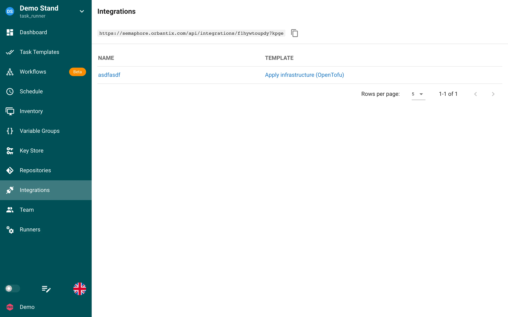
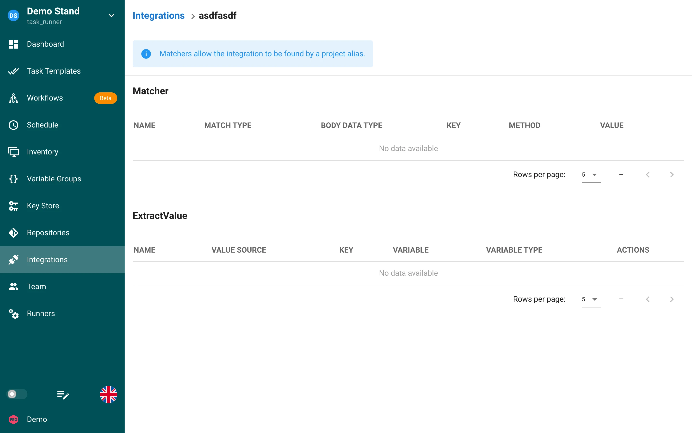

# Интеграции

Интеграции позволяют наладить взаимодействие между Semaphore и внешними сервисами, такими как GitHub и GitLab.

URL вебхука проекта показан над списком. У каждой интеграции есть имя и шаблон, который она запускает; щёлкните по интеграции, чтобы настроить её сопоставители и извлечение значений.

С помощью интеграции можно запускать конкретный шаблон, обращаясь к специальному эндпоинту (алиасу), для которого можно настроить один из следующих способов аутентификации:
* GitHub Webhooks
* Токен
* HMAC
* Без аутентификации

Алиас представляет собой URL следующего вида: `/api/integrations/<random_string>`. Поддерживаются запросы `GET` и `POST`.

## Сопоставители

С помощью сопоставителей (matchers) можно задать параметры входящего запроса. Когда эти параметры совпадают, вызывается шаблон.

## Извлечение значений

С помощью извлекателя (extractor) можно взять данные из заголовка или тела запроса (поле JSON или строка) и передать их в задачу. У каждого извлечённого значения есть **тип переменной**:

* **Environment**: значение добавляется к переменным окружения задачи и переопределяет одноимённую переменную из группы переменных.
* **Task parameter**: значение становится параметром задачи, например переменной опроса или подсказкой.

## Параметры задачи

Интеграции могут запускать задачи с параметрами. Используйте извлечение значений, чтобы сформировать JSON-нагрузку для параметров задачи, и настройте шаблон так, чтобы он принимал запрашиваемые значения.

## Замечания об алиасах и сопоставителях

Алиас проекта (URL над списком интеграций) общий для всех интеграций проекта: Semaphore проверяет сопоставители каждой интеграции и запускает шаблоны тех интеграций, чьи сопоставители совпали. У интеграции может быть и собственный алиас; запросы к нему запускают именно эту интеграцию без проверки сопоставителей. При необходимости используйте аутентификацию по токену или HMAC и передавайте параметры через извлекатели.
