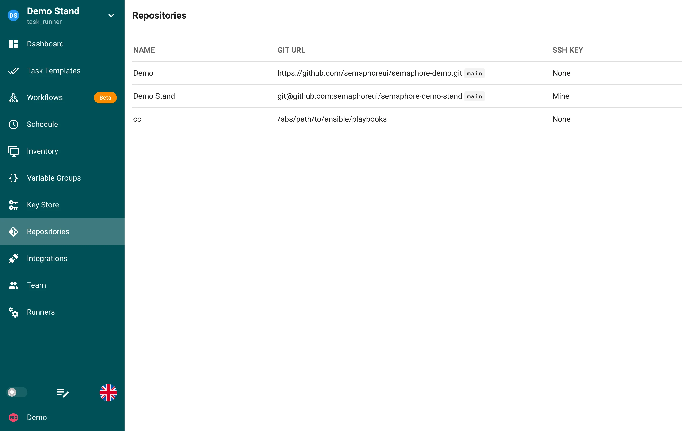

# Repozitorijumi

Repozitorijum (Repository) je mesto za čuvanje i upravljanje Ansible sadržajem kao što su playbook-ovi i role.

Lista prikazuje naziv, Git URL sa granom i ključ koji se koristi za autentifikaciju.

Semaphore razume repozitorijume koji su:
  * lokalni sistem datoteka (`/path/to/the/repo`)
  * lokalni Git repozitorijum (`file://`)
  * udaljeni Git repozitorijum kome se pristupa preko HTTPS-a (`https://`), SSH-a (`ssh://` ili kratki oblik `git@host:org/repo.git`)
  * protokol `git://` je podržan, ali se ne preporučuje iz bezbednosnih razloga.

Svi šabloni zadataka (Task Templates) zahtevaju repozitorijum da bi se izvršili.

## Autentifikacija

Ako koristite udaljeni repozitorijum koji zahteva autentifikaciju, moraćete da konfigurišete ključ u odeljku **Key Store** (skladište ključeva) Semaphore-a.

Za udaljene repozitorijume koji koriste SSH moraćete da koristite svoj SSH ključ u odeljku **Key Store**.

Za udaljene repozitorijume koji nemaju autentifikaciju možete kreirati ključ tipa `None`.

## Kreiranje novog repozitorijuma

1. Proverite da ste u odeljku skladišta ključeva konfigurisali ključ za repozitorijum koji dodajete.

2. Idite u odeljak Repozitorijumi (Repositories) u Semaphore-u i kliknite na dugme **New Repository** u gornjem desnom uglu.

3. Konfigurišite repozitorijum:
    * Dajte naziv repozitorijumu
    * Dodajte URL. URL mora da počinje jednim od sledećeg:
        * `/path/to/the/repo` za lokalni folder na sistemu datoteka
        * `https://` za udaljeni Git repozitorijum kome se pristupa preko HTTPS-a
        * `ssh://` za udaljeni Git repozitorijum kome se pristupa preko SSH-a
        * `file://` za lokalni Git repozitorijum
        * `git://` za udaljeni Git repozitorijum kome se pristupa preko Git protokola
    * Podesite granu repozitorijuma; ako niste sigurni koja bi trebalo da bude, verovatno je master ili main
    * Izaberite **Access Key** koji ste konfigurisali pre podešavanja ovog repozitorijuma.

4. Kliknite Save kada je sve konfigurisano.

## Izmena postojećeg repozitorijuma

1. Idite u odeljak Repozitorijumi u Semaphore-u.

2. Kliknite na ikonu olovke pored repozitorijuma koji želite da promenite i prikazaće vam se konfiguracija repozitorijuma.

## Brisanje repozitorijuma

Proverite da repozitorijum koji brišete ne koristi nijedan šablon zadatka.
Repozitorijum se ne može obrisati ako se koristi u bilo kom šablonu zadatka:
1. Idite u odeljak Repozitorijumi u Semaphore-u.

2. Kliknite na ikonu kante za otpatke pored repozitorijuma koji želite da obrišete.

3. Kliknite Yes u dijalogu za potvrdu ako ste sigurni da želite da obrišete ovaj repozitorijum.

## Zahtevi

Pri inicijalizaciji projekta Semaphore traži i instalira Ansible role i kolekcije iz requirements.yml na sledećim lokacijama i sledećim redosledom.

### Role

* `playbook_dir`/roles/requirements.yml
* `playbook_dir`/requirements.yml
* `repo_path`/roles/requirements.yml
* `repo_path`/requirements.yml

### Kolekcije

* `playbook_dir`/collections/requirements.yml
* `playbook_dir`/requirements.yml
* `repo_path`/collections/requirements.yml
* `repo_path`/requirements.yml

### Logika obrade

* Svaka datoteka se obrađuje nezavisno
* Ako datoteka postoji, obrađuje se prema svom tipu (role ili kolekcija)
* Ako obrada bilo koje datoteke rezultuje greškom, proces instalacije se zaustavlja i vraća grešku
* Ista datoteka requirements.yml u korenim direktorijumima (**`playbook_dir`/requirements.yml** i **`repo_path`/requirements.yml**) obrađuje se dva puta - jednom za role i jednom za kolekcije

Semaphore će pokušati da obradi sve ove lokacije bez obzira na to da li su prethodne lokacije pronađene ili uspešno obrađene, osim u slučaju grešaka.
